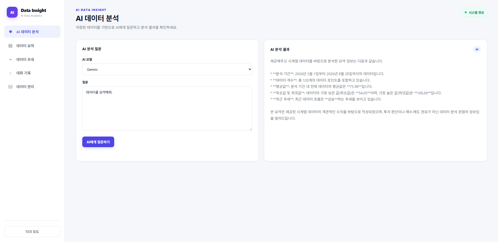
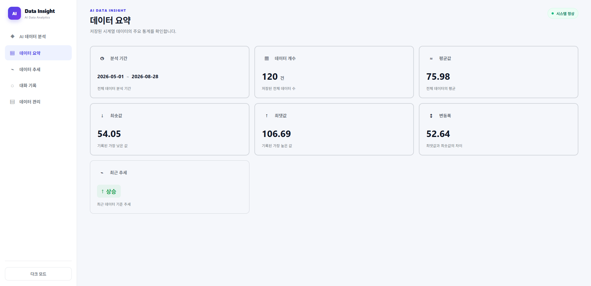
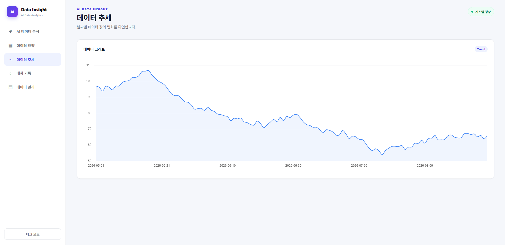
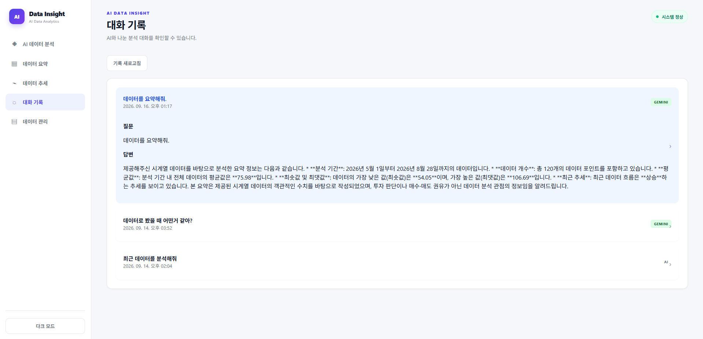
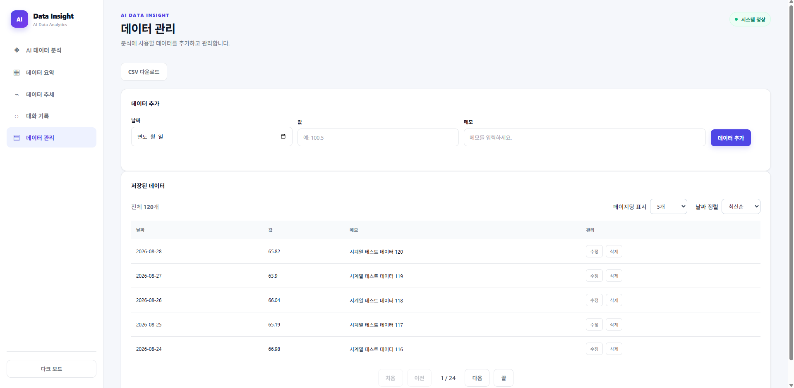
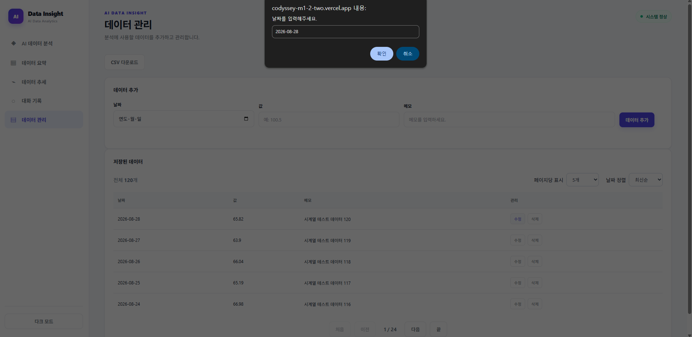

# codyssey_m1_2

# AI Data Insight

AI를 활용해 저장된 데이터를 분석하고, 데이터 요약·추세·대화 기록을 확인할 수 있는 웹 서비스입니다.

사용자는 날짜별 데이터를 등록하고, Gemini 또는 OpenAI 모델을 선택해 데이터에 대한 질문을 입력할 수 있습니다. AI는 저장된 데이터를 기반으로 분석 결과를 제공하며, 질문과 답변은 대화 기록으로 저장됩니다.

---

## 배포 주소

* **Frontend:** `https://codyssey-m1-2-two.vercel.app/`
* **Backend:** `https://codyssey-m1-2-m3ox.onrender.com`


---

## 주요 기능

### 1. AI 데이터 분석

* Gemini 또는 OpenAI 모델 선택
* 데이터에 대한 자연어 질문 입력
* 저장된 데이터를 기반으로 AI 분석 결과 제공
* AI 분석 결과 화면 표시
* 분석 질문과 답변 저장

예시 질문:

* 최근 데이터의 추세를 분석해줘.
* 가장 높은 값을 기록한 날짜를 알려줘.
* 데이터의 평균과 변동폭을 설명해줘.
* 최근 데이터에서 주의할 점을 알려줘.

### 2. 데이터 요약

저장된 데이터를 기반으로 다음 정보를 제공합니다.

* 전체 분석 기간
* 저장된 데이터 개수
* 평균값
* 최솟값
* 최댓값
* 변동폭
* 최근 추세


**요약 기간 필터 및 재요약:** 기간 필터는 `backend/routers/data.py`의 `get_data_summary`에 적용하고, 데이터 변경 시 `frontend/js/app.js`의 `loadSummary()`를 호출하여 변경된 데이터를 기준으로 요약을 다시 생성합니다.

### 3. 데이터 추세

날짜별 데이터 값을 선 그래프로 표시합니다.

* 날짜별 값 확인
* 데이터 변화 추세 확인
* 반응형 그래프 제공
* 모바일 화면 지원

### 4. 데이터 관리

분석에 사용할 데이터를 직접 관리할 수 있습니다.

* 데이터 추가
* 데이터 수정
* 데이터 삭제
* 저장된 데이터 조회
* CSV 파일 다운로드

데이터 항목:

| 항목 | 설명            |
| -- | ------------- |
| 날짜 | 데이터가 기록된 날짜   |
| 값  | 분석할 숫자 데이터    |
| 메모 | 데이터에 대한 추가 설명 |

### 5. 대화 기록

AI에게 질문한 기록을 확인할 수 있습니다.

* AI 모델 정보 확인
* 질문 내용 확인
* AI 답변 확인
* 대화 기록 새로고침
* 대화 항목 펼쳐보기

### 6. 다크 모드

화면 테마를 다크 모드와 라이트 모드로 변경할 수 있습니다.

---

## 기술 스택

### Frontend

* HTML5
* CSS3
* JavaScript
* Chart.js
* Vercel

### Backend

* Python
* FastAPI
* Uvicorn
* Render

### Database

* Firebase Firestore

### AI

* Google Gemini API
* OpenAI API

---

## 프로젝트 구조

```text
AI-Data-Insight/
├─ frontend/
│  ├─ index.html
│  ├─ css/
│  │  └─ style.css
│  └─ js/
│     └─ app.js
│
├─ backend/
│  ├─ main.py
│  ├─ requirements.txt
│  ├─ seed_data.py
│  ├─ models/
│  │  └─ __init__.py
│  │  └─ chat.py
│  │  └─ conversation.py
│  │  └─ data.py
│  ├─ routers/
│  │  └─ __init__.py
│  │  └─ chat.py
│  │  └─ conversations.py
│  │  └─ data.py
│  └─ services/
│     └─ __init__.py
│     └─ ai_service.py
│     └─ firebase_service.py
└─ README.md
```
### 디렉터리별 역할

- **routers/**: 클라이언트의 요청을 받아 요청 데이터를 검증하고, 적절한 응답을 반환하는 API 라우터를 관리합니다.
- **services/**: 데이터 처리, AI 분석, 비즈니스 규칙 등 실제 서비스 로직을 담당합니다. 라우터와 비즈니스 로직을 분리하여 코드의 재사용성과 유지보수성을 높였습니다.


---

## 실행 환경

* Python 3.10 이상
* 웹 브라우저
* Firebase 프로젝트
* Gemini API Key 또는 OpenAI API Key

---

## Backend 설치 및 실행

### 1. 저장소 복제

```bash
git clone https://github.com/byeongchan/codyssey_m1_2
cd 저장소이름
```

### 2. 백엔드 폴더 이동

```bash
cd backend
```

### 3. 가상환경 생성

Windows:

```bash
python -m venv venv
venv\Scripts\activate
```

macOS / Linux:

```bash
python3 -m venv venv
source venv/bin/activate
```

### 4. 패키지 설치

```bash
pip install -r requirements.txt
```

### 5. 환경 변수 설정

백엔드 실행에 필요한 환경 변수를 설정합니다.

예시:

```env
GEMINI_API_KEY=your_gemini_api_key
OPENAI_API_KEY=your_openai_api_key
FIREBASE_SERVICE_ACCOUNT_JSON={...}
```

### 6. 로컬 서버 실행

`main.py`에 `app = FastAPI()`가 있다면 다음 명령어를 실행합니다.

```bash
uvicorn main:app --reload
```

서버 실행 후 다음 주소에서 API 문서를 확인할 수 있습니다.

```text
http://127.0.0.1:8000/docs
```

---

## Frontend 실행

프론트엔드는 별도의 빌드 과정 없이 HTML 파일을 통해 실행할 수 있습니다.

로컬에서 실행하려면 `frontend/index.html`을 브라우저로 열거나 Live Server를 사용할 수 있습니다.

프론트엔드 JavaScript의 백엔드 주소를 확인해야 합니다.

```javascript
const API_BASE_URL = "https://your-backend.onrender.com";
```

개발 환경에서는 다음과 같이 설정할 수 있습니다.

```javascript
const API_BASE_URL = "http://127.0.0.1:8000";
```

배포 환경에서는 반드시 Render에서 발급받은 백엔드 주소를 사용해야 합니다.

---

## API 목록

| Method   | Endpoint                               | 설명             |
| -------- | -------------------------------------- | -------------- |
| `POST`   | `/api/chat`                            | AI에게 데이터 분석 질문 |
| `GET`    | `/api/data`                            | 저장된 데이터 조회     |
| `POST`   | `/api/data`                            | 데이터 추가         |
| `PUT`    | `/api/data/{data_id}`                  | 데이터 수정         |
| `DELETE` | `/api/data/{data_id}`                  | 데이터 삭제         |
| `GET`    | `/api/data/summary`                    | 저장된 데이터를 요약하고 통계 정보를 반환      |
| `GET`    | `/api/conversations`                   | 대화 기록 조회       |
| `GET`    | `/api/conversations/{conversation_id}` | 특정 대화 조회       |

### 데이터 요약 엔드포인트 분리 이유

데이터 요약 기능은 `backend/routers/data.py`의 `get_data_summary()`를 별도 엔드포인트로 분리하여 관리합니다. 이를 통해 AI 분석, 대시보드, 데이터 추세 등 여러 기능에서 동일한 요약 결과를 재사용할 수 있으며, 요청 처리와 데이터 가공 로직을 분리해 코드의 유지보수성을 높였습니다. 또한 요약 결과를 캐시하도록 확장하면 반복적인 데이터 계산을 줄이고 응답 속도를 개선할 수 있습니다. AI 분석 시에도 원본 데이터 전체가 아닌 요약 정보를 활용할 수 있어 프롬프트의 토큰 사용량과 API 비용을 절감하는 효과를 기대할 수 있습니다.

---

## AI 분석 요청 예시

### Request

```json
{
  "provider": "gemini",
  "question": "최근 데이터의 추세를 분석해줘."
}
```

### Response

```json
{
  "answer": "최근 데이터는 전반적으로 상승하는 추세를 보이고 있습니다."
}
```

---

## 데이터 추가 요청 예시

### Request

```json
{
  "date": "2026-09-16",
  "value": 120.5,
  "memo": "테스트 데이터"
}
```

### Response

```json
{
  "message": "데이터가 추가되었습니다."
}
```

---

## Render 배포

### 1. GitHub 저장소 연결

Render에서 GitHub 저장소를 연결합니다.

### 2. Web Service 생성

Render 대시보드에서 다음 순서로 진행합니다.

```text
New + → Web Service → GitHub Repository 선택
```

### 3. 배포 설정

| 항목            | 설정값                                            |
| ------------- | ---------------------------------------------- |
| Runtime       | Python 3                                       |
| Branch        | main                                           |
| Build Command | `pip install -r requirements.txt`              |
| Start Command | `uvicorn main:app --host 0.0.0.0 --port $PORT` |
| Instance Type | Free                                           |

### 4. 환경 변수 등록

Render의 Environment Variables 메뉴에서 API Key와 Firebase 관련 환경 변수를 등록합니다.

### 5. 배포 확인

배포가 완료되면 다음 주소로 접속해 API 문서를 확인합니다.

```text
https://your-backend.onrender.com/docs
```

---

## Vercel 배포

### 1. GitHub 저장소 연결

Vercel에서 GitHub 저장소를 연결합니다.

### 2. 프론트엔드 폴더 설정

프론트엔드가 `frontend` 폴더에 있다면 Root Directory를 다음과 같이 설정합니다.

```text
frontend
```

### 3. 빌드 설정

| 항목               | 설정값   |
| ---------------- | ----- |
| Framework Preset | Other |
| Build Command    | 비워두기  |
| Install Command  | 비워두기  |
| Output Directory | `.`   |

### 4. 백엔드 주소 연결

`frontend/js/app.js`의 API 주소를 Render 배포 주소로 변경합니다.

```javascript
const API_BASE_URL = "https://your-backend.onrender.com";
```

수정 후 GitHub에 push하면 Vercel이 자동으로 재배포됩니다.

---

## 환경 변수 및 보안

API Key와 Firebase 인증 정보는 GitHub에 직접 업로드하지 않습니다.

### 주의사항

* `.env` 파일을 GitHub에 올리지 않기
* API Key를 HTML, JavaScript 코드에 직접 작성하지 않기
* Firebase 서비스 계정 JSON 파일을 저장소에 업로드하지 않기
* API Key가 노출되면 즉시 폐기하고 새 키 발급하기
* Render의 Environment Variables에 비밀 정보 등록하기
* `.gitignore`에 환경 변수 파일 추가하기

예시:

```gitignore
.env
.env.local
venv/
__pycache__/
*.pyc
```

---

## 오류 해결

### 1. `Failed to fetch`

다음 항목을 확인합니다.

* Render 백엔드 서버가 실행 중인지 확인
* `API_BASE_URL`이 Render 주소로 설정되어 있는지 확인
* API 경로가 백엔드 코드와 일치하는지 확인
* CORS 설정이 되어 있는지 확인
* 브라우저 개발자 도구의 Console과 Network 확인

### 2. `404 Not Found`

다음 항목을 확인합니다.

* 요청 URL 확인
* HTTP Method 확인
* 백엔드에 해당 API가 구현되어 있는지 확인
* `/api` 경로가 중복으로 작성되지 않았는지 확인

### 3. `500 Internal Server Error`

Render 로그에서 오류 내용을 확인합니다.

* 환경 변수 누락 여부
* Gemini 또는 OpenAI API Key 오류
* Firebase 인증 오류
* Firestore 권한 오류
* 요청 데이터 형식 오류

### 4. CORS 오류

FastAPI에 프론트엔드 주소를 허용해야 합니다.

```python
from fastapi.middleware.cors import CORSMiddleware

app.add_middleware(
    CORSMiddleware,
    allow_origins=[
        "https://your-frontend.vercel.app"
    ],
    allow_credentials=True,
    allow_methods=["*"],
    allow_headers=["*"],
)
```

---

## AI API 사용 시 고려사항

AI API는 요청량과 모델에 따라 응답 시간과 비용이 달라질 수 있습니다.

### 응답 지연

* AI 모델의 응답 시간이 길어질 수 있음
* 네트워크 상태에 따라 응답 시간이 달라질 수 있음
* Render 무료 인스턴스는 일정 시간 사용하지 않으면 대기 상태가 될 수 있음

### 비용 관리

* 필요한 경우에만 AI 요청 실행
* 질문 길이 제한 설정
* 가벼운 모델 사용 검토
* 동일한 질문에 대한 캐싱 검토
* API 사용량 및 비용 주기적 확인

### API 오류 대응

AI API가 일시적으로 사용 불가능한 경우를 고려해 사용자에게 오류 메시지를 표시합니다.

예시:

```text
AI 답변을 생성하지 못했습니다.
잠시 후 다시 시도해주세요.
```
### 컨텍스트 주입 전략

사용자의 질문과 데이터 요약 정보를 함께 AI 모델에 전달하여, 분석 대상 데이터에 근거한 일관성 있는 응답을 생성하도록 설계했습니다. 컨텍스트 주입을 사용하면 AI가 사용자의 질문뿐만 아니라 현재 데이터의 주요 내용도 함께 참고할 수 있어 응답의 정확성과 일관성을 높일 수 있습니다. 다만 데이터 요약 정보가 매 요청마다 프롬프트에 포함되므로 입력 토큰과 API 사용 비용이 증가할 수 있으며, 데이터 규모가 커질수록 응답 시간이 길어질 수 있습니다. 따라서 현재 구조에서는 전체 원본 데이터가 아닌 요약 정보를 주입하여 컨텍스트의 유용성을 유지하면서 토큰 비용과 처리 부담을 줄였습니다.

`build_prompt()`는 사용자의 질문과 데이터 요약 정보를 AI 프롬프트에 함께 주입합니다. 이를 통해 데이터에 근거한 일관된 응답을 얻을 수 있지만, 요청마다 요약 정보가 포함되므로 토큰 사용량과 API 비용이 증가할 수 있습니다. 따라서 원본 데이터 전체가 아닌 요약 정보를 활용해 응답 품질과 비용 사이의 균형을 고려했습니다.
---

## 데이터 저장 방식

본 서비스는 Firebase Firestore를 사용하여 데이터를 저장합니다.

저장되는 주요 데이터는 다음과 같습니다.

### 데이터 정보

* 날짜
* 값
* 메모
* 데이터 ID

### 대화 정보

AI 답변 생성이 완료된 후 다음 정보를 Firestore에 저장합니다.

- 사용한 AI 모델
- 질문
- AI 답변
- 생성 시간
- 대화 제목

답변 생성 후 저장하는 방식은 실제로 사용자에게 제공된 결과만 기록하기 위한 것입니다. 또한 질문, 답변, 모델, 생성 시간, 제목을 개별 필드로 저장하여 대화 기록의 복원과 탐색이 쉽도록 구성했습니다. 대화 목록에서는 제목과 생성 시간을 활용하고, 상세 조회에서는 질문과 AI 답변을 불러오는 등 기능별로 필요한 데이터를 재사용할 수 있습니다.

---

## Render 무료 인스턴스 콜드스타트 대응

Render 무료 인스턴스는 일정 시간 요청이 없으면 대기 상태로 전환될 수 있습니다. 이 경우 첫 요청을 처리하기 위해 서버가 다시 실행되면서 초기 응답이 평소보다 늦어질 수 있습니다. 이를 완화하기 위해 외부 모니터링 서비스에서 일정한 간격으로 백엔드의 상태 확인 엔드포인트를 호출하는 프리워밍 방식을 적용할 수 있습니다. 다만 프리워밍은 인스턴스의 대기 상태 전환을 완전히 방지하지 못할 수 있으므로, 사용자에게 첫 요청 시 응답이 지연될 수 있음을 안내하도록 구성했습니다.

> **이용 안내:**  
> 서버가 대기 상태에서 다시 실행되는 경우 첫 분석 요청에 평소보다 시간이 걸릴 수 있습니다. 잠시 기다린 후에도 응답이 표시되지 않으면 페이지를 새로고침하고 다시 시도해 주세요.

### 서버 상태 확인

백엔드 서버의 실행 상태를 확인하기 위해 상태 확인용 엔드포인트를 사용할 수 있습니다.

```http
GET /health
```

---

## 프로젝트 실행 흐름

```text
사용자 데이터 입력
        ↓
Frontend에서 API 요청
        ↓
FastAPI Backend
        ↓
Firestore 데이터 조회
        ↓
Gemini 또는 OpenAI API 호출
        ↓
AI 분석 결과 반환
        ↓
Frontend에 결과 표시
        ↓
대화 기록 저장
```

---

## 향후 개선 사항

* 사용자 로그인 및 개인별 데이터 관리
* CSV 파일 업로드 기능
* 다양한 차트 유형 추가
* 날짜 범위 필터 기능
* AI 분석 결과 다운로드
* 분석 결과 PDF 저장
* 데이터 자동 정렬 및 검색
* AI 분석 결과에 대한 근거 데이터 표시
* API 요청 실패 시 재시도 기능
* 데이터 백업 및 복원 기능

---

## 제작 목적

데이터를 직접 입력하고 AI에게 자연어로 질문하면서, 복잡한 데이터 분석 과정을 쉽게 경험할 수 있도록 제작했습니다.

본 프로젝트를 통해 다음 기술을 학습하고 적용했습니다.

* HTML/CSS/JavaScript 기반 웹 화면 구현
* FastAPI를 이용한 REST API 개발
* Firebase Firestore 데이터 저장
* Gemini 및 OpenAI API 연동
* Chart.js를 활용한 데이터 시각화
* Vercel 프론트엔드 배포
* Render 백엔드 배포
* GitHub를 활용한 소스 코드 관리

---

## 접속 스크린샷
### 1. 데이터 분석 페이지
<p align='center'></p>

### 2. 데이터 요약 페이지
<p align='center'></p>

### 3. 데이터 추세 페이지
<p align='center'></p>

### 4. 대화 기록 페이지
<p align='center'></p>

### 5. 데이터 관리 페이지
<p align='center'></p>

### 5.1 데이터 관리 페이지(수정)
<p align='center'></p>